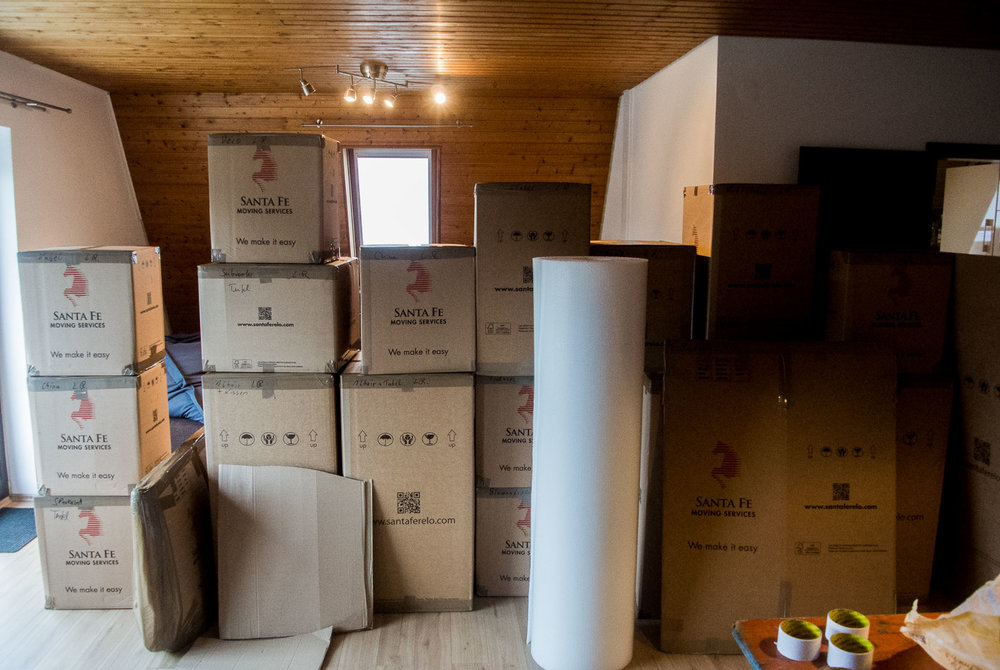
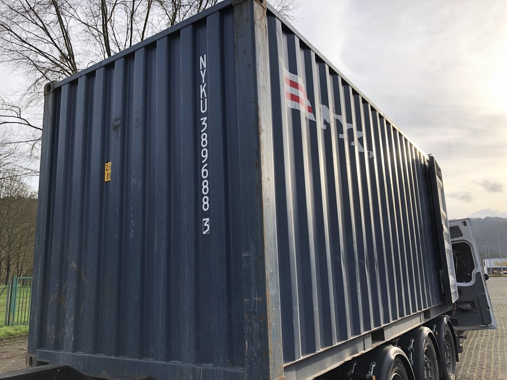
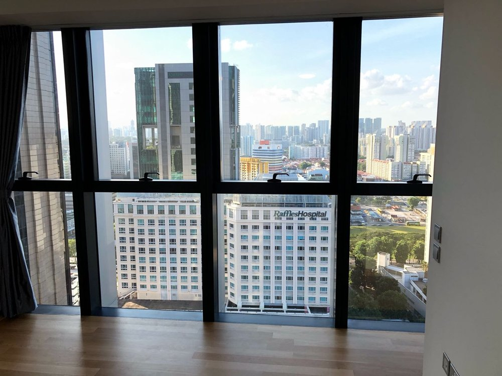
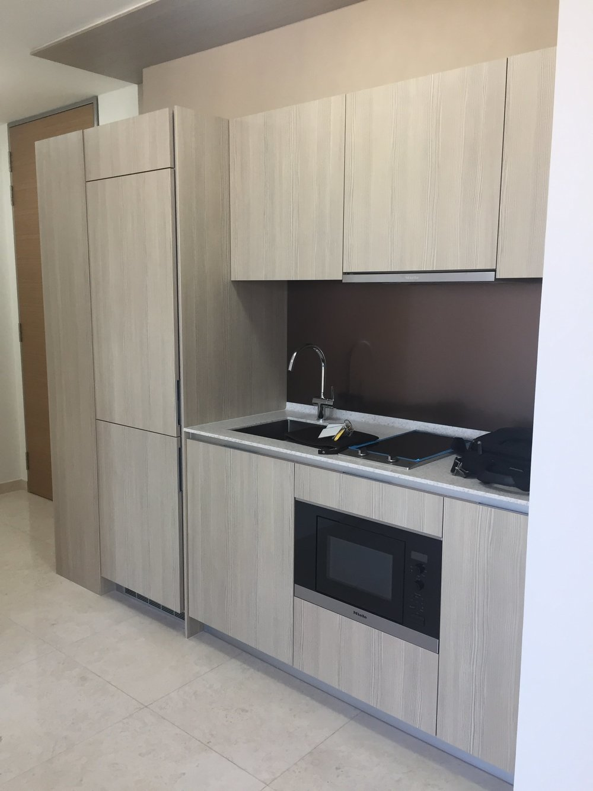
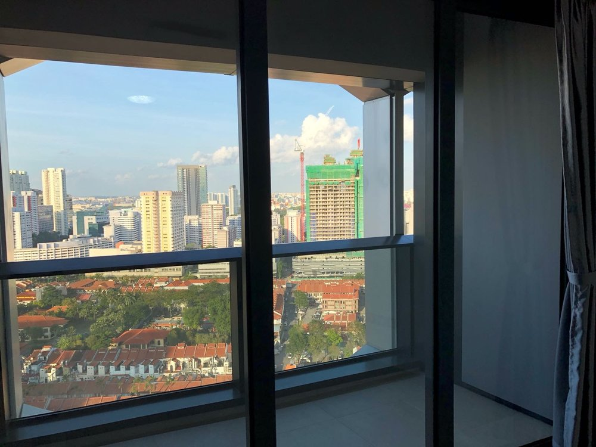
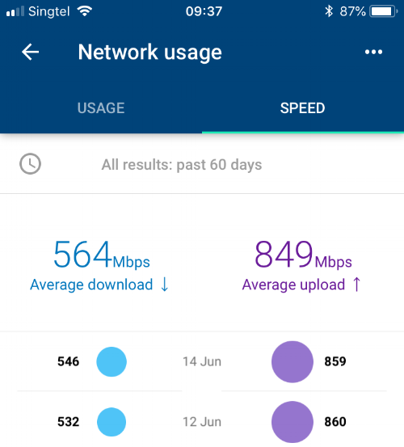

## Why we considered Singapore a good idea

My husband always wanted to live and work outside of Germany for a while and he kind of managed to convince me to join him. The main reasons for Singapore were the secure, safe and developed country in the middle of this great region of Asia. We love travelling and exploring countries, so what really got us, was the location of Singapore. After almost 5 months we don’t regret our move here at all. We love the variety of affordable food and not affordable drinks, convenience of public transport, the super efficient airport that gets you almost everywhere and yes we even enjoy the always warm (hot & humid) climate here. Additionally to that we enjoy working and living with so many different ethnic groups, cultures and just types of people.

I want to maintain the following section like a glossary and keep expanding it as we go - so expect some additional content once in a while.

## Germany - What you need to do before leaving

### Signoff Germany

When your moving date is confirmed, create a list with all insurances and contracts (see below) you want to cancel and prepare the letters. Doing this early will help you during the more hectic time towards the end. Furthermore check out the earliest day at the registration office, to deregister as a German resident (you will need the landlords resignation confirmation). After you receive your deregistration, you can start sending out letters - make sure to attach the deregistration.

### Cancelling / contract termination

*   Insurances
    
*   Work
    
*   Utilities
    
*   Car
    
*   Internet
    
*   Mobile Phone
    
*   Memberships
    
*   GEZ
    

### Furnitures & sizing - make sure you check

Moving from a German town to a packed Asian city requires some planning. Your furniture might not fit into what you can afford at your destination. We were lucky enough to go on a little home search before actually moving and decided to get rid of our king-size-bed, wardrobe, dining table and sofa. It was all just too big for the shape and size of Singaporean apartments we were interested in.

### Containers / estimation of value

Shipping from Germany to Singapore took about 6 weeks. To get a proper insurance we had to estimate the value of our total household goods - quite interesting way to figure out how much stuff you actually have. This made us rethink so we eventually sold a lot.

### Packing for 4 weeks

In our first 4 weeks we stayed in a temporary apartment. This gave us time to wait for our container to arrive and find a suitable apartment in Singapore. You either bring stuff on the plane or ship it and wait for about a month. Make sure not to bring too much, the temporary apartment will have a washing machine. Your most important documents should be with you of course.

### Estimating cost of living - Will we have enough money?

There are heaps of sites, allowing you to calculate your cost of living and compare it to other cities. It’s really important to get an idea of the cost, so you know what to expect. A calculation sheet in google docs worked pretty well for us, as you can share it and both work on it simultaneously. Alcohol is very expensive, public transport is cheap and food can be both. That of course all depends on your preferences and where you’re from. A comparison website is a good place to [start](https://www.expatistan.com/cost-of-living) .

### Local contract vs. German contract

If your company supports your move, there are generally two options:

1.  **local contract** - leaving the safety of the German super social contracts.
    
2.  **assignment** while keeping your German contract.
    

While option two might sound very secure and safe for most Germans, it really depends on your current situation, the company package offered and the country you’re actually moving to. Think about it carefully and do the math!

### Translation

Translate your recent resume, certifications and your marriage certificate. I used [Lingoking](https://www.lingoking.com/), where you can send your documents for translation and accreditation.

### Certificates & documents required

*   Passport
    
*   Marriage certificate
    
*   Company confirmation of place of residence - you usually try to sign up for a bank account while your still in your temporary apartment, so you don’t have a real tenancy agreement yet..
    
*   Employment pass / dependent pass - this is the visa we are on and of course it is required for everything you do here.
    

### Retirement

You have two options when leaving Germany:

1.  Having worked in Germany for more than 5 years you are allowed to continue paying into German retirement system.
    
2.  You can completely quit and take care of retirement yourself. Singapore won’t let you participate in their retirement fund unless you become a permanent resident.
    

### Home search trip

We were fortunate to get the chance to go for a home search trip before actually moving. I can definitely recommend that to get an idea of rental cost and apartment sizes. We spent 2 days with an agent finding out which type of apartment fits most to us. Before going on a Home search trip, do some research on neighborhoods, list your favorites and let your agent know what else is important to you:

*   Neighborhood
    
*   MRT
    
*   Supermarket
    
*   Parks
    
*   Bars, Restaurants
    
*   (avoid construction areas)
    
*   Balcony
    
*   Facilities
    

## Singapore - All you need to take care of when arriving

### Home search

Of course you have to find a home as soon as possible but not too early in case you are shipping all your goods. Home search took us about two weeks, where we spent time visiting more than 30 apartments with our agent. The biggest challenges during this time for sure were:

*   **Location** - CBD was too empty on weekends, Holland Village was too far off, other regions had too much construction going on etc. we decided for Bugis which we really enjoy.
    
*   **Apartment shape** - as mentioned above Germany has a completely different floor plan-style. So 70 sqm are completely different. In Germany you would expect a quite spacious open design with enough room to have a big living room, dining table and sofa. In Singapore 70 sqm is usually a two bedroom apartment with two bathrooms which does not exactly fit the same furniture and the living style of Germans.
    

### Health-Insurance

Non-Permanent-Residents won’t be included in the public healthcare system, so you will have to take care of this yourself. Many companies offer some sort of insurance for their employees and in case this won’t completely cover your needs you’ll have to look for private top-up-coverage. We signed up for two private insurances separately to cover maternity and incorporate my husbands company policy properly as deduction from the private one.

### Bank account

Plenty of option if you have the required documents mentioned above. Make sure to declare as tax foreigner with your old bank accounts in case you keep them.

### Credit card

Same here. You will be spending a lot of money in Singapore, so make sure you collect miles or something like this with your spending’s. This will, after all, finance a couple of nice weekend-trip-flights. Most offer a first year fee waiver, so you could swap through the different options or negotiate with the provider.

### Employment pass / Dependent pass

*   Our visa is an employment pass and the respective dependent pass. These are bound to the employer and allow you to live in Singapore for two years before your employer will need to renew it.
    
*   The process to get the in-principle-approval (IPA) took about 3 weeks. IPA allows you to get the EP/DP on arrival (or rather start the process below).
    
*   If your company takes care of this, it’s really easy. All documents are prepared and all you have to do is visit the Ministry of Manpower to take photos and your EP/DP will be on its way.
    
*   The DP does not directly allow you to work in Singapore. If you manage to get a job your employer will need to file a letter of consent, that allows you to start working with that employer.
    

### Utilities

This is real simple. Singapore has one supplier, so your housing agent just signs you up there and you get monthly bills on your smartphone.

### Rental contract

*   You can get a good overview of properties on [PropertyGuru](https://www.propertyguru.com.sg/).
    
*   Singapore [URA](https://www.ura.gov.sg/realEstateIIWeb/resiRental/search.action) provides a great website with details on past rental costs for all rental contracts per condo. So if you want to get a good idea of what an apartment of a particular price with cost you in that condo just check out what others have been paying in the past.
    
*   That gives you a good benchmark to negotiate with the landlord - right, you can actually negotiate! This does not only include the price but also things like day curtains etc. you might want to be installed before moving in.
    
*   Contracts are usually set for short-term (< 1 year), mid-term (between 1 and 2) and long-term (2 year) and should include a diplomatic clause to let you cancel the contract in case you need to leave the country after a year.
    

### Grocery shopping

In a city like Singapore you won't have any problems finding your everyday life product's. There are a lot of supermarkets like

*   Cold Storage - a little more expensive, but a lot of European stuff
    
*   Fair Price & Giant - comparable to a German Aldi or Lidl
    
*   Country specific Supermarkets like the German Supermarket
    
*   Watson's & Guardian  (health & beauty care)
    

Most people don’t own a car so supermarkets offer delivery services, where everything is delivered right to your doorstep. They just pack a lot of plastic bags so even bananas are wrapped in plastic…

### Aircon maintenance

Needs to be done 4 times a year (if not otherwise stated in your rental contract). Just [compare prices](https://www.socool.sg/).

### Handymen

Handymen can do almost everything, we just haven’t found one who is actually good at something. Whenever something needs to be done a Handyman will take care of it, but especially if you’re used to skilled and trained German workers this can be quite shocking. My husband usually watches these guys closely and tend to just fix the problem himself!

### Temporary apartment

We stayed at [Frasers Place](https://www.frasershospitality.com/en) for about four weeks.

### Internet

Coming from Germany (a 3rd-World-Internet-Country) this is simply amazing. I’ll let a picture do the talking - this is the smallest contract we could get:

\[caption id="" align="alignnone" width="500.0"\] High-speed Internet \[/caption\]

### Mobile contract

The main providers are **Singtel, M1** and **Starhub**. Compare the offers and go to your favorite to sign up. There won't be a huge difference. It’s quite cheap after all and you get decent data packages.

### Finding a job

I had a job coach supporting me to create a professional resume, cover letter and get trained in having a job interview here in Singapore. Like in Germany there are different platforms for job offers. I sent out 20 applications and got a job after 2 months. I guess that was quite lucky. We talked to different people having found no Job after 6 month. It’s probably best to start with almost anything and then keep searching as it’s easiest to get into something by having the connections.

### Working on a DP

It will be much easier for you to find a job on a Dependent Pass. Otherwise the companies have to apply for an Employment Pass for you and that will mean a lot of work. So if you’re not married consider getting married before moving to Singapore - it’s a lot easier and being married is not bad anyway, isn't it?